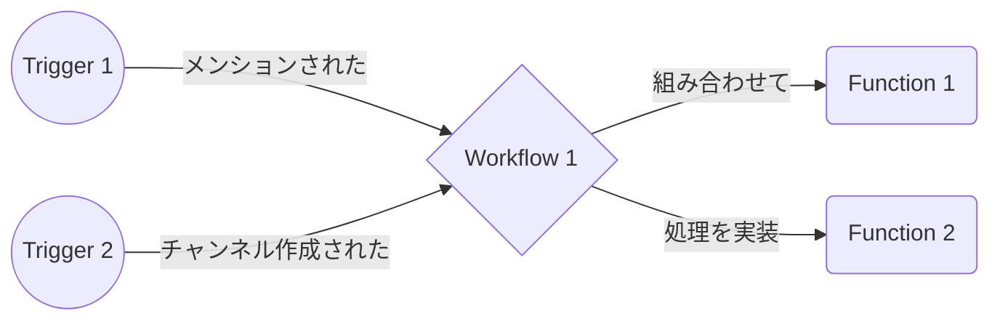

# ひとまず完全に理解する

:::message
自分で完全に理解したい方はこちら → [https://api.slack.com/future](https://api.slack.com/future)
:::



## Trigger

### なにそれ

- 何かしらのタイミングでWorkflowを呼び出すやつ
- 種類によって受け取れるデータがいろいろ

### 例

- スケジュールで定期的に
- 新しいチャンネルが作成された
- 新しい絵文字が作成された
- メッセが投稿された
- メッセにリアクションが付いた
- etc

### なんで分離されてる？

- 同じWorkflowを色々なトリガで呼び出すため
    - `channel_created` と `channel_renamed` で同じWorkflowを呼び出すとか

## Workflow

### なにそれ

- FunctionをStepとして組み合わせてやりたいことを実装するやつ
- Triggerから入力を受け取る

### 例

- 新しく作成されたチャンネルをお知らせ
- 新しく作成された絵文字をお知らせ

### なんで分離されてる？

- TriggerとFunction群を橋渡しするため

## Function

### なにそれ

- テスト可能な単位に処理を分割して実装するやつ
- 入力と出力を持つ

### 例

- メンションされた文字列からコマンドを抽出する
- 投稿するメッセージ文字列を作る
- Built-inなFunctionも
    - `Schema.slack.functions.SendMessage`
    - `Schema.slack.functions.OpenForm`

### なんで分離されてる？

- テスト可能にするため
- 再利用性を上げるため
- 配布しやすくするため

# 始め方を完全に理解する

:::message
自分で完全に理解したい方はこちら → [https://api.slack.com/future/quickstart](https://api.slack.com/future/quickstart)
:::

↓を実行するだけで必要なツールは全部入ります（Mac / Linuxの場合）（`deno` はHomebrewでインストールされます）。

```bash
curl -fsSL https://downloads.slack-edge.com/slack-cli/install.sh | bash
```

↓を実行して表示されるスラッシュコマンドをSlackに貼り付けて投稿するだけで認証完了。

```bash
slack login
```

↓を実行して使ってるWorkspaceが表示されたら準備OKです。

```bash
slack info
```

↓を実行して雛形をとりあえず作成できます。

```bash
slack create [name] --template https://github.com/slack-samples/deno-starter-template
```

# Triggerを完全に理解する

:::message
自分で完全に理解したい方はこちら → [https://api.slack.com/future/triggers](https://api.slack.com/future/triggers)
:::

例えば「チャンネルが新規作成されたとき」のTriggerはこちら。

```tsx
import { Trigger } from "deno-slack-api/types.ts";
import NotifyWorkflow from "../workflows/notify.ts";

const notifyTrigger: Trigger<typeof NotifyWorkflow.definition> = {
  type: "event",
  name: "Notify channel created",
  description: "Notify channel created",
  workflow: "#/workflows/notify_workflow",
  inputs: {
    new_channel_id: {
      value: "{{data.channel_id}}",
    },
    new_channel_name: {
      value: "{{data.channel_name}}",
    },
  },
  event: {
    event_type: "slack#/events/channel_created",
  },
};

export default notifyTrigger;
```

:::message
「`type` に指定できるもの」や「`data` から取れるもの」 はこちら → [https://api.slack.com/future/triggers#types](https://api.slack.com/future/triggers#types)
:::

Triggerを作成・更新・削除します。TriggerはWorkflowとは別に独立してデプロイ(?)する必要があります。

```bash
slack trigger create --trigger-def triggers/channel_created.ts
slack trigger update --trigger-def triggers/channel_created.ts --trigger-id ABCDE12345
slack trigger delete --trigger-id ABCDE12345
```

# Workflowを完全に理解する

:::message
自分で完全に理解したい方はこちら → [https://api.slack.com/future/workflows](https://api.slack.com/future/workflows)
:::

例えば「自分で実装した `SendMessageFunctionDefinition` を呼び出す」のWorkflowはこちら。

Workflowが受け取るデータを `DefineWorkflow` の `input_parameters` で指定して、 `addStep` するときに `XxxWorkflow.inputs` から取り出します。

`addStep` したFunctionの出力を別のStepで使いたい場合は、 `addStep` の返り値を変数 `xxxStep` に格納して `xxxStep.outputs` で取り出します。

```tsx
import { DefineWorkflow, Schema } from "deno-slack-sdk/mod.ts";
import { SendMessageFunctionDefinition } from "../functions/send_message.ts";

const NotifyWorkflow = DefineWorkflow({
  callback_id: "notify_workflow",
  title: "Notify new channel",
  description: "Notify new channel",
  input_parameters: {
    properties: {
      new_channel_id: {
        type: Schema.types.string,
      },
      new_channel_name: {
        type: Schema.types.string,
      },
    },
    required: ["new_channel_id", "new_channel_name"],
  },
});

NotifyWorkflow.addStep(SendMessageFunctionDefinition, {
  new_channel_id: NotifyWorkflow.inputs.new_channel_id,
  new_channel_name: NotifyWorkflow.inputs.new_channel_name,
});

export default NotifyWorkflow;
```

Triggerとは別にWorkflowをデプロイします。Workflowは↓のように `manifest.ts` の `workflows` に持たせて `$ slack deploy` することでデプロイできます。

ローカル開発環境でデバッグする場合は `$ slack run` が便利です。

```tsx
import { Manifest } from "deno-slack-sdk/mod.ts";
import NotifyWorkflow from "./workflows/notify.ts";

export default Manifest({
  name: "notify-new-channel",
  description: "Notify new channel created/renamed",
  icon: "assets/icon.png",
  workflows: [NotifyWorkflow],
  outgoingDomains: [],
  botScopes: [
    "commands",
    "chat:write",
    "chat:write.public",
    "channels:read",
  ],
});
```

# Functionを完全に理解する

:::message
自分で完全に理解したい方はこちら → [https://api.slack.com/future/functions](https://api.slack.com/future/functions)
とこちら → [https://api.slack.com/future/functions/custom](https://api.slack.com/future/functions/custom)
:::

例えば「チャンネル名とチャンネルIDを受け取ってメッセージを作って投稿する」のFunctionはこちら。
→ [https://github.com/rinchsan/notify-new-channel/blob/main/functions/send_message.ts](https://github.com/rinchsan/notify-new-channel/blob/main/functions/send_message.ts)

`inputs` とは別で受け取れる `env` は↓を実行して設定できます。Slackのクラウド上に暗号化されて保存されます。

```bash
slack env add my-key secret-value
```

さらに、 `inputs` と `env` に加えて受け取れる `client` はSlack APIを呼び出せるので便利です。

# Functionのテストを完全に理解する

:::message
Functionのテストに関するドキュメントは全然ないです。Slackさん追加してくれ！
:::

↑で例に出したFunctionのテストはこちら。
→ [https://github.com/rinchsan/notify-new-channel/blob/main/functions/send_message_test.ts](https://github.com/rinchsan/notify-new-channel/blob/main/functions/send_message_test.ts)

`deno-slack-sdk/mod.ts` の `SlackFunctionTester` がとても便利で、返り値の `createContext` を使えばとても簡単にテストが書けて便利です。

`createContext` を使うと `client` をデフォルトでStub(?)してくれるんですが、おそらく正常系しかテスト出来ないので、API Callを柔軟にモックしたい場合は [`deno.land/x/mock_fetch`](https://deno.land/x/mock_fetch) などを使うと良いでしょう。

ちなみに、↓のコマンド群でテストを実行しつつカバレッジを計測することが出来て便利です。 `coverage` オプションはまだ `UNSTABLE` なのでご注意を。

```bash
deno test --allow-net --coverage=cover
deno coverage cover/
rm -rf cover/
```

# その他便利な機能を完全に理解する

## [Logging](https://api.slack.com/future/logging)

`console.log` で出力したログを↓で見れます。便利。

```bash
slack activity --tail
```

## [Datastore](https://api.slack.com/future/datastores)

詳細は~~書くのめんどくさいので~~多機能すぎるので割愛しますが、なんとデータストアも使えます。

## [VSCode Extension](https://marketplace.visualstudio.com/items?itemName=denoland.vscode-deno)

DenoのVSCode Extensionがとても便利です。めっちゃ色々補完が効くのでドキュメント見なくてもコード書けます。

## [Permissions](https://api.slack.com/future/admin)

Workspace内のどのUserにデプロイ権限を付けるか選べます。

## [Collaborations](https://api.slack.com/future/faq#collaboration)

複数人で同じSlack Appを開発することも出来ます。ただチームで開発するならいい感じにCI/CDを組んで自動デプロイのパイプラインを組みたいところ。

# 完全に理解したぜ！

じゃあなんか作ろう！

例に使った「新しくチャンネルがCreate or Renameされたら通知する」のSlack Appのコード全体はこちら。
→ https://github.com/rinchsan/notify-new-channel
